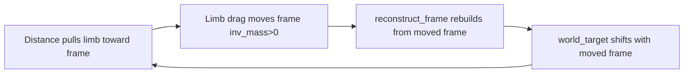

# Why Spine Control Fights the Shape-Matching Correction

## The symptom

Pressing a spin key works in one direction, but pressing the **opposite** direction
folds the character into a weird shape. The character does not simply reverse its
turn; it collapses, warps, and then "snaps" once the reversal completes.

## Two writers, same particles

The spine controller and the shape-matching corrector both mutate the **same**
particles, with opposite intent.

The spine control drives **5** particles:

```text
[ PH, P0, P1, P2, P3 ]
```

The connection frame is **4** particles:

```text
[ P30 (left_hip), P31 (right_hip), P3 (spine_base), P2 (spine_mid) ]
```

`P2` and `P3` appear in **both** lists. They are simultaneously:

- spine particles, which `claculate_velocity_spine` spins with a tangential
  (torque) velocity, and
- frame particles, which the shape-matching corrector counter-rotates with a
  rigid `-drag` offset.

Every spin command on the spine is therefore half-cancelled at the frame, and
every frame correction is interpreted by the spine controller as a rotation
error that must be re-corrected. The two write paths fight each other on the
same two particles.

## Where the two paths live

**Spin control (writes velocity):**

- [`claculate_velocity_spine()`](../../examples/game_lib/src/character/systems.rs:50)
  computes a tangential velocity on each spine particle to rotate the spine
  toward `desired_dir`.
- It emits `CharacterPivotVelocityEvent`, which becomes a direct velocity write
  via [`queue_connect_particle_velocity()`](../../../study_vello/integrations/vello_physics/src/collision_response.rs:308).

**Shape-matching correction (writes position, opposite direction):**

- [`PositionConstraint::solve()`](../../../study_vello/integrations/vello_physics/src/connection_constraint.rs:314)
  drags each limb particle toward its frame-local target and records that drag
  in `cache_delta`.
- [`solve_constraints()`](../../../study_vello/integrations/vello_physics/src/soft_body_connection.rs:582)
  seeds the transmission graph with `cache_delta`, walks it bottom-up, and
  applies `-drag` to the four frame particles as a rigid offset.

Because `P2`/`P3` are frame particles, the spin-control rotation of `P2`/`P3`
is exactly the "drag" the corrector sees and cancels. The corrector cannot tell
the difference between:

1. limb pull that legitimately should be cancelled (the feedback loop), and
2. a deliberate control rotation that should be **preserved**.

That is the core conflict: **the correction treats control authority as
disturbance.**

## The `dot_val < -0.99` amplifier

The reversal bug is made violent by a special case in the spin controller:

```rust
let rotation_error = if dot_val < -0.99 {
    config.rotation_gain * 2.0   // constant large spin on ~180° reversal
} else {
    cross_val
};
```

When the spine faces directly away from the desired direction (`dot_val` near
`-1`), `cross_val` is nearly zero (a `sin`-like term). A pure cross product
would stall at the reversal point. The `-0.99` branch replaces that near-zero
signal with a **constant large** spin (`rotation_gain * 2.0`), which does not
decay as the spine comes around.

Combined with the corrector:

1. reversal → controller injects a constant large spin on `P2`/`P3`;
2. corrector reads that spin as drag and counter-rotates the frame;
3. the spine "sees" the counter-rotation as additional error → the controller
   keeps injecting the constant spin;
4. the character folds until the reversal finally completes.

The `-0.99` branch is a reasonable hack for a normal kinematic spine, but it is
**incompatible** with a dynamic frame that actively counter-rotates.

## `cache_delta` is a conflated signal

`cache_delta` is *measured correctly* but it is a **sum of two different
things**:

```text
cache_delta = drag_follow + drag_feedback
```

- `drag_follow` — a limb legitimately chasing a frame that the *control* moved.
  This should **not** be cancelled.
- `drag_feedback` — the positive-feedback loop where limb pull moves the frame,
  which moves the target, which re-forms the pull. This is the instability that
  **should** be cancelled.

The transmission graph feeds both into the same canceller. There is no way,
from `cache_delta` alone, to separate control-induced frame motion from
feedback-induced frame motion. This is why "collecting it wrong" is not the
problem — the signal itself is ambiguous.

## The energy constraint: the correction is load-bearing

The correction cannot simply be deleted, because it is the only thing keeping a
**dynamic** frame stable.

The frame particles currently have `inv_mass > 0`. That makes the distance
constraint able to move the frame:

```rust
// DistanceConstraint::solve
p1.pos += delta_lambda * p1.inv_mass * dir;
p2.pos -= delta_lambda * p2.inv_mass * dir;
```

If a limb pull moves a frame particle, [`reconstruct_frame()`](../../../study_vello/integrations/vello_physics/src/soft_body_connection.rs:558)
rebuilds the frame from the moved position, and the next
[`PositionConstraint::solve()`](../../../study_vello/integrations/vello_physics/src/connection_constraint.rs:321)
re-derives `world_target` from the moved frame. The target then chases the
particle being pulled toward it — a positive-feedback loop that injects energy
every substep:



The `-drag` canceller is what breaks that loop. So "dumping the correction" does
**not** just remove an anti-pull; it removes the rigidity that makes the pull
energy-bounded. Deleting it destabilizes the active pull the user wants to keep.

## Why "make the frame kinematic" (inv_mass = 0) is not the answer

A tempting fix is to give the frame particles infinite mass (`inv_mass = 0.0`)
so the distance constraints can no longer move them. That is ruled out: the
frame is **not a separate rigid object** — it is *derived from* the body's own
core particles.

`P2`/`P3` are spine particles and `P30`/`P31` are hips. They are anchored to the
rest of the body by distance constraints, and those constraints are exactly what
keep the frame **attached to** the character. With `inv_mass = 0.0`:

```rust
// DistanceConstraint::solve with a zero-mass frame particle
p1.pos += delta_lambda * p1.inv_mass * dir;   // frame side: * 0.0 -> frozen
p2.pos -= delta_lambda * p2.inv_mass * dir;   // limb side: still moves
```

- the distance constraints can no longer move the frame particles, so the frame
  stops following the body;
- the body then swings around a frame frozen in world space, and the two drift
  apart.

This is the user's point: making the frame take nothing from the other
particles is equivalent to building a **standalone** frame, and a standalone
frame drifts away. The frame must stay **dynamic and coupled** — its pose is
the aggregate of where the body's core particles actually are, and the
distance-constraint pull is the mechanism that keeps it there. Infinite mass
deletes that coupling, not just the feedback.

## The real design target

Four requirements must hold simultaneously:

1. the frame stays **coupled** to the body (dynamic, not kinematic);
2. the distance-constraint **pull** stays (it both shapes the limbs and anchors
   the frame);
3. the correction stays in some form (it keeps the pull energy-bounded);
4. the spin control stops being read as disturbance.

The current corrector violates (4) because it cancels the *total* frame response
to limb drag, and that total includes the control's rotation. `cache_delta`
cannot distinguish control motion from feedback motion — and geometry does not
separate them either. A spin is a rigid frame rotation, and the corrector's
`-drag` (via `apply_rigid_offset_to_frame`) is *also* a rigid frame rotation.
Both live in the same channel, so no per-frame geometric decomposition can tell
them apart.

The distinction is **causal, not geometric**: control motion is *intended* (the
controller commanded it), feedback motion is *unintended* (the pull caused it and
the target then chased it). The corrector cannot recover causality from
`cache_delta`, which is why it keeps eating the spin command.

Two workable directions follow:

- **Separate the channels.** Route control through a single frame authority that
  writes the whole frame as one rigid transform, and let the corrector measure
  only the *residual* between the live frame and the intended pose. This is
  generic as long as "intended pose" is a frame concept, not a spine concept.
- **Break the loop at its source.** The feedback exists because
  `world_target = frame.local_to_world(local_target)` uses the *live* frame that
  the pull just moved. If shape-matching instead used a decoupled reference
  frame (previous-step, smoothed, or control-intended), the target stops chasing
  the pulled particle, the loop collapses, and no canceller is needed.

Both preserve the pull, keep the frame coupled, and remove the corrector's fight
with control. Neither is a mass flag — `inv_mass = 0.0` is ruled out.
