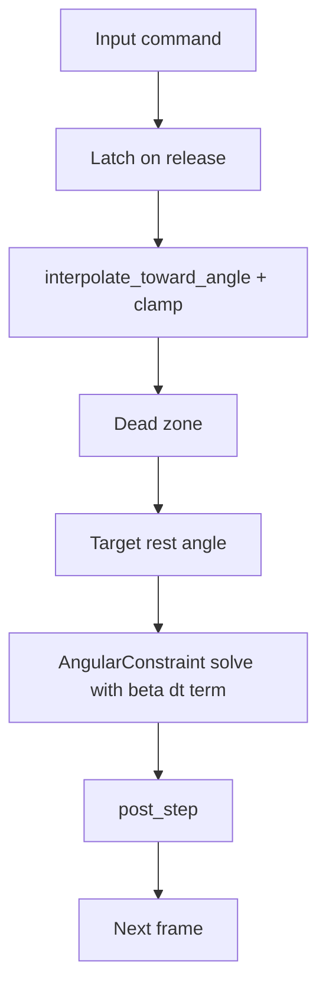

# Arm Servo Stabilization Plan

## Context & Goal

We are building toward an active-ragdoll character that walks the floor under gravity (see [`gravity_and_walking.md`](bevy_vello/plans/gravity_and_walking.md)). Before building the leg controller, we fix the **arm controller** as a cheaper trial: the arm and leg share the same servo mechanism (joint-angle chase + XPBD angular constraint), so stabilizing the arm first de-risks the leg.

The arm controller is currently broken in two distinct ways:

1. **Rotates too slow** — the joint chase soft-saturates and undershoots its rate.
2. **Waggles** — it oscillates around the target instead of settling.

## Problem: two symptoms, two different axes

| Symptom | Root cause | Fix axis |
|---|---|---|
| Slow rotation | [`rotate_toward()`](bevy_vello/examples/game_lib/src/character/systems.rs:677) uses tanh half-angle soft saturation and reaches only ~76% of `max_angle_rate` | **Target space** |
| Waggle | P-only rest-angle chase: a stiff spring with no damper, so it overshoots and oscillates | **Feedback / damping space** |

## Why the current dampers are not the answer

The two "weird" damping implementations are actually the same formula:

- [`ExternalPositionConstraint::damp_particle_velocity()`](study_vello/integrations/vello_physics/src/connection_constraint.rs:275)
- [`SoftBodyConnections::apply_fk_damping()`](study_vello/integrations/vello_physics/src/soft_body_connection.rs:281)

```rust
let damping_sacle = damping * (1.0 - (1.0 / distance).clamp(0.0, 1.0)) + (1.0 - damping);
let offset = damping_sacle * (p.pos - p.previous_pos);
p.previous_pos = p.pos - offset;
```

Decoded, this is a pure **velocity-space filter** (`s = 1 - damping + damping·min(1/d, 1)`) that:

- never moves `pos` — only rewinds `previous_pos`;
- is **position-gated** — brakes hard near the target, barely touches anything far away;
- is **not `dt`-aware**, so it feels different at different substep counts.

It cannot cure the waggle: the waggle is a stiff spring overshooting every correction, and a filter that only shaves velocity *after* the solve is fighting the symptom, not the overshoot. It is also a nonstandard, hand-rolled approximation of what the field solves with a joint-space PD tracker.

## The standard solution: joint-space PD / XPBD damping

The mature, well-studied answer for physics-based characters (SIMBICON 2007, Coros 2010, DeepMimic 2018) is a **proportional-derivative (PD) tracker** on every joint:

```
correction = kp * (θ_desired - θ_current) - kd * θ̇
```

Our solver is XPBD (compliance-based constraints, no torques), so the canonical equivalent is **damping baked into the constraint solve** (Macklin/Müller). The damped XPBD update adds a term next to the existing compliance term:

```
Δλ = ( -C - α̃·λ - β̃·Ċ ) / ( ∇Cᵀ M⁻¹ ∇C + α̃ )

α̃ = α / dt²     ← spring (P), already present
β̃ = β / dt      ← damper (D), the term to add
Ċ = ∇Cᵀ · v     ← constraint velocity
```

The code already shows the `α/dt²` form in [`ExternalPositionConstraint::solve()`](study_vello/integrations/vello_physics/src/connection_constraint.rs:259):

```rust
let alpha = self.compliance / (dt * dt);
let delta_lambda = current_length / (p.inv_mass + alpha);
p.pos += delta_lambda * p.inv_mass * dir;
```

For the angular constraint, `C = θ - θ_rest` so `Ċ = θ̇`, giving the new term `-(β/dt)·θ̇` — which is exactly the `-kd·θ̇` derivative term with `kd = β/dt`.

### Why this is the right choice

- It is the **standard**, so tuning has a known reference: critical damping `β_crit = 2·√(m/α)` with `k = 1/α`.
- It is **`dt`-aware** (`β/dt`), unlike the distance-gated dampers and the `0.999` global leak.
- It damps **all** angular constraints consistently, so the arm work transfers directly to the leg.

## Plan (ordered steps)



### Step 1 — Reconcile the P spring baseline

[`ArmConfig`](bevy_vello/examples/game_lib/src/character/mod.rs:99) defaults `angular_compliance` to `5e-8`, while the comment on the same struct says "0.1 is a good start" — a ~1000x discrepancy. Decide the intended arm stiffness and make the code and comment agree. `k = 1/angular_compliance` is the `kp` of the PD pair, so this is the P baseline everything else tunes against.

### Step 2 — Add `β/dt` damping to [`AngularConstraint::solve()`](study_vello/integrations/vello_physics/src/constraints.rs:558)

Add a damping coefficient (call it `damping` or `β`) to [`AngularConstraintConfig`](study_vello/integrations/vello_physics/src/constraints.rs:403), and incorporate the `-β̃·θ̇` term into the solve alongside the existing compliance `α̃`. This is the primary waggle fix and the standard XPBD D term. Angular velocity `θ̇` can be estimated from the particle velocities or from the angle change across the step.

### Step 3 — Add `β/dt` damping to [`ExternalPositionConstraint::solve()`](study_vello/integrations/vello_physics/src/connection_constraint.rs:259)

Mirror the same `β̃` term on the linear position servo (`Ċ = dot(v, dir)`). This properly damps the FK/position pulls and is the prerequisite for removing the post-hoc filter. Add `damping` to [`ExternalPositionConstraintConfig`](study_vello/integrations/vello_physics/src/lib.rs:52) alongside the existing `compliance`.

### Step 4 — Remove the post-hoc distance-gated dampers

Once Steps 2–3 land and are tuned:

- Delete [`damp_particle_velocity()`](study_vello/integrations/vello_physics/src/connection_constraint.rs:275) and the drain loop in [`external_position_constraint_damping()`](study_vello/integrations/vello_physics/src/soft_body_connection.rs:142).
- In [`apply_fk_damping()`](study_vello/integrations/vello_physics/src/soft_body_connection.rs:281), keep the `fk_targets` computation (the game side reads it and re-queues external position constraints) and delete only the damping loop.

**Verify during implementation** that the FK pull path is actually via `ExternalPositionConstraint` (the `get_connect_fk_target` → one-time constraint round-trip), so nothing is left undamped after removal.

### Step 5 — Make the `0.999` global leak `dt`-aware

In [`SoftBodyConnections::update_particles_velocity()`](study_vello/integrations/vello_physics/src/soft_body_connection.rs:130), replace the constant:

```rust
// before
p.velocity = 0.999 * (p.pos - p.previous_pos) / dt
// after
p.velocity = (-lambda * dt).exp() * (p.pos - p.previous_pos) / dt
```

`0.999` at 60 Hz corresponds to `lambda ≈ 0.060` (`lambda = -60·ln(0.999)`), so that value preserves the current feel while making it frame-rate independent.

### Step 6 — Add the shoulder dead zone

[`calculate_arm_ik()`](bevy_vello/examples/game_lib/src/character/systems.rs:526) gives the forearm a dead zone (`FOREARM_ANGULAR_EPSILON`) but the shoulder correction has none, so it chases on every sub-frame correction. Mirror the forearm guard onto the shoulder.

### Step 7 — Replace `rotate_toward` with interpolate-then-clamp

Swap [`rotate_toward()`](bevy_vello/examples/game_lib/src/character/systems.rs:677) for [`interpolate_toward_angle()`](bevy_vello/examples/game_lib/src/character/systems.rs:296) in the arm IK, using `max_angle_rate` as `max_step`. This reuses the spine-proven interpolate-then-clamp scheme and fixes the slow rotation.

### Step 8 — Add the spine-style latch

Freeze the desired arm heading when the input releases (`command_active` → hold the last desired angle), matching the spine controller's latch behavior. This stops the arm from chasing a stale target and contributes to a clean settle.

### Step 9 — Expose knobs and wire the tuning UI

Add to [`ArmConfig`](bevy_vello/examples/game_lib/src/character/mod.rs:99): the reconciled `angular_compliance`, the damping `β` (or `kd`), the shoulder dead zone, and `max_angle_rate`. Wire sliders in [`character_tuning_main.rs`](bevy_vello/examples/collision_detection/src/character_tuning_main.rs) so all four can be tuned live.

### Step 10 — Build and tune

`cargo check`, then tune in [`character_tuning_main.rs`](bevy_vello/examples/collision_detection/src/character_tuning_main.rs) until both symptoms are gone:

- Slow rotation → adjust `max_angle_rate` + confirm the interpolate clamp.
- Waggle → raise `β` toward `β_crit = 2·√(m/α)` until the arm settles without overshoot.

## File touch list

| File | Change |
|---|---|
| [`study_vello/integrations/vello_physics/src/constraints.rs`](study_vello/integrations/vello_physics/src/constraints.rs:403) | add `β` to `AngularConstraintConfig`, add damping term to `AngularConstraint::solve` |
| [`study_vello/integrations/vello_physics/src/connection_constraint.rs`](study_vello/integrations/vello_physics/src/connection_constraint.rs:259) | add `β` to `ExternalPositionConstraint`, damping term in `solve`, remove `damp_particle_velocity` |
| [`study_vello/integrations/vello_physics/src/lib.rs`](study_vello/integrations/vello_physics/src/lib.rs:52) | add `damping` to `ExternalPositionConstraintConfig` |
| [`study_vello/integrations/vello_physics/src/soft_body_connection.rs`](study_vello/integrations/vello_physics/src/soft_body_connection.rs:130) | dt-aware `0.999`, remove distance-gated damping loop, keep `fk_targets` |
| [`bevy_vello/examples/game_lib/src/character/mod.rs`](bevy_vello/examples/game_lib/src/character/mod.rs:99) | reconcile `angular_compliance`, add `damping`/dead-zone knobs to `ArmConfig` |
| [`bevy_vello/examples/game_lib/src/character/systems.rs`](bevy_vello/examples/game_lib/src/character/systems.rs:526) | shoulder dead zone, interpolate-then-clamp, latch-on-release |
| [`bevy_vello/examples/collision_detection/src/character_tuning_main.rs`](bevy_vello/examples/collision_detection/src/character_tuning_main.rs) | UI sliders for the new knobs |

## Verification notes & risks

- **FK pull path**: confirm FK targets are enforced through `ExternalPositionConstraint` before removing the FK damping loop, or the limbs will go undamped.
- **Ordering**: Steps 2–3 must land and be verified before Step 4 removes the only current damping.
- **`β_crit` reference**: `β_crit = 2·√(m/α)` is a starting point, not a final value — expect to tune below it (slightly underdamped feels livelier for game characters).
- **Regression risk**: the `β/dt` change touches the shared angular constraint used by the spine; verify the spine controller still behaves before moving on.
