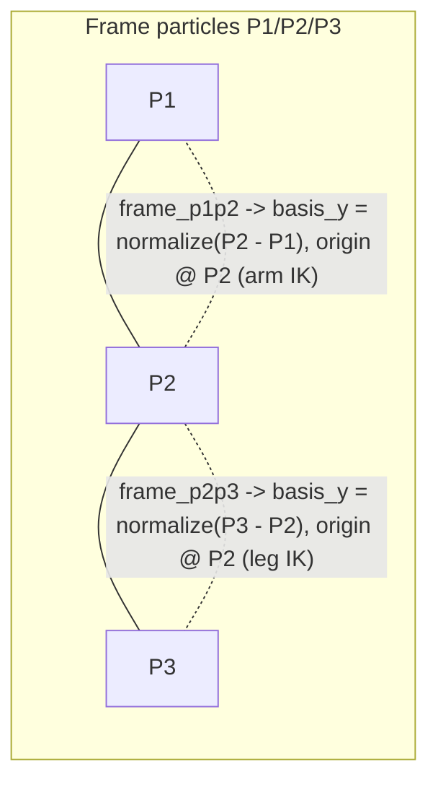

# Two Segment-Based `BalancedCoreFrame` (Implementation Plan)

> Status: PLAN. Implements the first step from `two_particle_spine_frames.md`: replace the single
> 4-particle `BalancedCoreFrame` with **two** 2-particle segment frames, both anchored at **P2** as
> the shared rotation center. Collision propagation is **out of scope** for this step.

## Scope

- Add a segment-based constructor to `BalancedCoreFrame`.
- Build `frame_p1p2` and `frame_p2p3`, both with origin at P2.
- Keep the existing 4-arg `new` for back-compat (Open Question #4 in the design doc is deferred).
- Do **not** touch collision propagation, `apply_rigid_offset_to_frame`, or the transmission graph.

## Key finding driving the design

The current [`BalancedCoreFrame::new`](study_vello/integrations/vello_physics/src/utility.rs:789)
takes 4 particles but only reads **2** for the frame:

- `let _raw_x = hip_right - hip_left;` — hips are read and immediately discarded.
- orientation comes only from `spine_dir = normalize_or_zero(spine_mid - spine_base)`.
- origin is `spine_mid` (the rotation center).

So a segment (`P0 → P1`) plus a pivot fully determines the frame. The new constructor is the same
math, re-anchored to one segment and pinned at P2.

## Design

Two frames over the P1/P2/P3 spine, both using **P2 as origin/rotation center**:



For a segment `P0 → P1`, anchored at pivot `PC = P2`:

1. `raw = P1 - P0`
2. `spine_dir = if raw.y >= 0.0 { raw } else { -raw }` (preserve Y-down convention, mirroring
   [`utility.rs:805`](../study_vello/integrations/vello_physics/src/utility.rs:805))
3. `basis_y = spine_dir.normalize_or_zero()`
4. `basis_x = (basis_y.y, -basis_y.x)` (copy of the perpendicular rule at
   [`utility.rs:816`](../study_vello/integrations/vello_physics/src/utility.rs:816))
5. `to_world = Affine2::from_mat2_translation(Mat2::from_cols(basis_x, basis_y), PC)`
6. `to_local = to_world.inverse()`

## Understanding correct for step 2 vs step 3

- `frame_p1p2`: `basis_y = normalize(P2 - P1)`, origin at P2.
- `frame_p2p3`: `basis_y = normalize(P3 - P2)`, origin at P2.

Both share the P2 pivot, matching the current convention where the `to_world` translation is the
rotation center. Arm IK reads about P2 via `frame_p1p2`; future leg IK reads about P2 via
`frame_p2p3`.

## Implementation steps

### Step 1 — Add `from_segment` to `BalancedCoreFrame` ([`utility.rs:788`](../study_vello/integrations/vello_physics/src/utility.rs:788))

Add a constructor:

```rust
impl BalancedCoreFrame {
    /// Build a frame from one spine segment P0->P1 with the origin pinned at PC.
    /// The segment determines basis_y (and thus basis_x); PC is the rotation center.
    pub fn from_segment(p0: Vec2, p1: Vec2, origin: Vec2) -> Self {
        let raw = p1 - p0;
        let spine_dir = if raw.y >= 0.0 { raw } else { -raw };
        let basis_y = spine_dir.normalize_or_zero();
        let basis_x = Vec2::new(basis_y.y, -basis_y.x);
        let rotation_matrix = Mat2::from_cols(basis_x, basis_y);
        let to_world = Affine2::from_mat2_translation(rotation_matrix, origin);
        let to_local = to_world.inverse();
        Self { to_world, to_local }
    }
}
```

Keep the existing `new(hip_left, hip_right, spine_base, spine_mid)` unchanged for back-compat. To
avoid duplicated logic, optionally have `new` delegate to `from_segment(spine_base, spine_mid,
spine_mid)` since it already discards the hips.

### Step 2 — Build `frame_p1p2` and `frame_p2p3`

Add a convenience that constructs both frames from the three spine particle positions:

```rust
pub struct SpineFrames {
    pub frame_p1p2: BalancedCoreFrame, // origin at P2, for arm IK
    pub frame_p2p3: BalancedCoreFrame, // origin at P2, for leg IK
}

pub fn build_spine_frames(p1: Vec2, p2: Vec2, p3: Vec2) -> SpineFrames {
    SpineFrames {
        frame_p1p2: BalancedCoreFrame::from_segment(p1, p2, p2),
        frame_p2p3: BalancedCoreFrame::from_segment(p2, p3, p2),
    }
}
```

### Step 3 — Wire frame construction from the arena

Add a method (or follow the existing `initial_frame` pattern in
[`soft_body_connection.rs:301`](../study_vello/integrations/vello_physics/src/soft_body_connection.rs:301))
that reads P1/P2/P3 positions and calls `build_spine_frames`. Store both frames alongside the
existing `frame_reconstructor` so arm IK can read `frame_p1p2` and future leg IK can read
`frame_p2p3`. Do not remove the old `frame_reconstructor` yet.

### Step 4 — Unit tests

Add tests mirroring the existing pattern
([`test_balanced_core_frame_orthonormal_and_roundtrip`](../study_vello/integrations/vello_physics/src/utility.rs:926)):

- `frame_p1p2`: basis_y is `normalize(P2 - P1)`, origin maps `(0,0)` to P2, orthonormal, round-trips.
- `frame_p2p3`: basis_y is `normalize(P3 - P2)`, origin maps `(0,0)` to P2, orthonormal, round-trips.
- Degenerate segment (P0 == P1) yields zero basis (guarded by `normalize_or_zero`), no panic.

## Out of scope (deferred)

- Collision propagation onto P1/P2/P3 (`apply_rigid_offset_to_frame` stays 4-particle).
- Re-pointing arm IK call sites to actually consume `frame_p1p2` (Open Question #3).
- Migrating/removing the 4-arg `BalancedCoreFrame::new` API (Open Question #4).
- The compensating extra impulse and the transmission-graph rigidness re-use.

## Notes

- `apply_rigid_offset_to_frame` remains `[Vec2; 4]` and pivot `frame_positions[3]` for now.
- This is design-only realization wiring; the frames are built and available, but no consumer is
  re-pointed in this step.