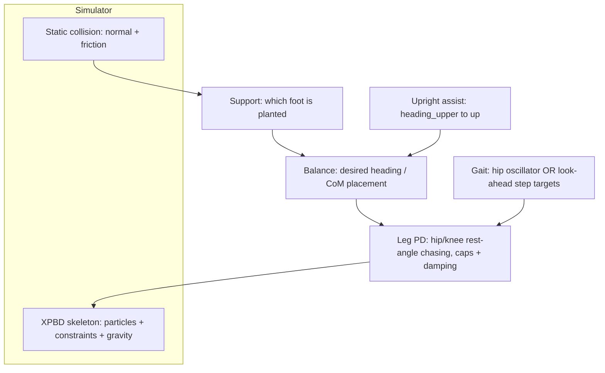

# Plan: Gravity + Walking for the Vello XPBD Character

> Status: **PLAN** (discussion → implementation, not yet coded)
> Reference: SIMBICON — Simple Biped Locomotion Control (SIGGRAPH 2007), Generalized
> Biped Walking Control (2010), Jakobsen — Advanced Character Physics (GDC 2001).
> Key advantage: pixel-accurate GPU line-trace + high-framerate collision detection,
> which lets us do **look-ahead foot placement** instead of relying purely on
> emergent contact.

---

## 1. Goal

A character that, under gravity, falls onto a floor, stands upright against it, and
walks it naturally — in the TABS idiom: a biased-upright ragdoll whose gait emerges
from a simple controller, tuned via sliders.

Non-goals for this plan: force-driven torso actuation, learning/optimization,
obstacle stepping, 3D.

---

## 2. Ground truth from the current code

Reading the solver paths pins down exactly where the work is:

1. **Gravity exists, but only reaches the soft body.** `GRAVITY` in
   `study_vello/integrations/vello_physics/src/collision_response.rs` is
   `Vec2::new(0.0, 98.0)` (Vello y-down: +y is "down" on screen, so the sign is
   already correct — no coordinate gymnastics). It is applied in
   `SoftBody::step()` via `apply_external_force(dt, gravity)`.

2. **The skeleton explicitly opts out.** `SoftBodyConnections` in
   `study_vello/integrations/vello_physics/src/soft_body_connection.rs` is annotated
   `// gravity free version`; `predict_positions()` integrates
   `p.pos += p.velocity * dt` with no `g·dt²`; `step()` receives no gravity.

3. **The spine pin currently does 100% of the "standing".** `tick_spine_drive()` in
   `bevy_vello/examples/game_lib/src/character/systems.rs` holds
   `desired_center` / `desired_heading_upper` / `desired_heading_lower` via external
   position constraints; with no floor, P2 floats because the pin holds it up.

4. **Collision + friction already exist.** `StaticCollisionConstraint` in
   `study_vello/integrations/vello_physics/src/constraints.rs` has a full normal +
   Coulomb-tangent solve (`friction_compliance`, the `lambda_t` block), and
   `make_static_scene()` in the tuning app already builds floor/wall bars.

5. **The two-heading spine servo is already the "attitude pin" we need.**
   `desired_heading_upper → up` is an upright assist independent of P2's translation.

6. **The walking anchor was reserved already.** `two_particle_spine_frames.md`:
   arm IK → P1–P2 frame, leg IK → P2–P3 frame.

**Conclusion:** "add gravity" is not a new feature — it is two edits and one call.
The only genuinely new subsystem is the **leg controller + gait**. Everything else is
wiring + tuning of primitives already present.

---

## 3. Control architecture (SIMBICON mapped to our code)



| SIMBICON principle | Our code |
|---|---|
| Upright bias (hidden assist) | `desired_heading_upper` in `SpineIndicator` |
| Balance by CoM placement | feeds `desired_heading` / `desired_center` (new) |
| PD joints with caps + damping | angular-rest chasing in `calculate_arm_ik()` |
| Foot contact + friction | `StaticCollisionConstraint` |
| Gait pattern | **new** `LegController` |
| Gain scheduling / tuning | existing egui sliders |

---

## 4. The one architectural decision

**Physical vs kinematic gravity.** We choose **physical**: add `g·dt²` to the
skeleton integration. Rationale:

- Consistent with the spine-is-heavy / limbs-are-light one-way hierarchy already built.
- Collisions already propagate limb→spine; physical gravity makes hits flop the
  character naturally.
- It is the smaller diff and the TABS-consistent path.

The position pin is **retained but softened** (raise `compliance`, or drop the
vertical DOF from `desired_center`), so the floor takes over "hold up" while the pin
only prevents tipping.

---

## 5. Phases

### Phase 0 — Enable gravity in the tuning app (one call)

Call `VelloConstraintWorld::set_gravity()` with `Vec2::new(0.0, 98.0)` in
`character_tuning_main.rs`.

**Accept:** soft bodies already fall correctly with gravity; the skeleton still
floats — confirming the gap is skeleton-side (Phase 1).

### Phase 1 — Feed gravity to the skeleton (the real fix)

- Add gravity to `SoftBodyConnections::predict_positions()`:
  `p.pos += p.velocity * dt + gravity * dt * dt` (mass-independent, matching
  `SoftBody::apply_external_force()`).
- Thread `gravity` from `ConstraintWorld::step()` — both the parallel and
  non-parallel paths — into `SoftBodyConnections::step()`.

**Accept:** the whole character drops under gravity; spine and limbs fall as a
coherent unit.

### Phase 2 — Land; stop levitating

Soften the P2 positional authority: raise `config.compliance`, or zero the vertical
component of `desired_center` so the pin stops fighting the floor's normal force.
Keep `desired_heading_upper → up` as the unbiased attitude pin (in y-down, "up" is
heading `-π/2`).

**Accept:** character settles on the existing floor, stays upright, no drift, no jitter.

### Phase 3 — Friction confirmation

Tune the existing `friction_compliance` so planted feet do not ice-skate but retain a
touch of slip. Add a friction slider to the tuning UI (mirror the friction slider in
`main.rs`).

**Accept:** a shove displaces the character but it does not glide indefinitely.

### Phase 4 — LegController (the only new subsystem)

Add a `LegController` mirroring `RightArmController`:

- Legs `P3 → P30/P31 → P40/P41 → PLLL/PRLL` (from `character_physics_rework.md`).
- Drive hip/knee angular rest angles exactly like `calculate_arm_ik()`: `rest_angle`
  chased with caps + damping.
- **Gait source — two options, pick by result:**
  - (a) hip phase oscillator `rest_angle = A·sin(ωt + φ)`, legs in antiphase
    (emergent, TABS-like);
  - (b) finite stance/swing FSM with explicit step targets (more controllable).
  Start with (a), fall back to (b) if needed.

**Accept:** character translates forward under gravity with a cyclic gait.

### Phase 5 — Balance feedback (small)

Fold a CoM-over-support error into the heading targets:
`desired_heading_upper += k·(CoM_x − feet_x)`. Because the two-heading redesign
exposed these as scalar targets, this is a small addition to `tick_spine_drive()`.

**Accept:** character recovers from torso perturbation without walking off a fall.

---

## 6. The GPU line-trace advantage (look-ahead foot placement)

Instead of waiting for foot-vs-static collision to happen, **probe the ground ahead
of time**. This converts the gait planner from emergence to predictable, tunable
placement.

Proposed query contract (additive; a wrapper over the existing raytrace call):

```rust
struct FootProbe {
    origin: Vec2,   // foot visible position, or P3 projected
    dir: Vec2,      // usually (0, 1) — down in y-down coords
    max_len: f32,
}
struct FootContact {
    hit: bool,
    point: Vec2,    // ground surface
    normal: Vec2,   // surface normal
    tangent: Vec2,  // = (-normal.y, normal.x)
    height: f32,    // for gait height profile
}
```

Uses:

1. **Swing target placement** — raycast down ahead of the hip to find where the swing
   foot should land; set the swing-foot external-position-constraint target there
   (reuses the same `CharacterExternalPositionConstraintEvent` path the spine uses).
2. **Terrain height sampling** — sweep several probes ahead to build a future height
   profile for stance leg-length adaptation, so hip height does not force foot
   penetration or float on slopes.
3. **Ledge/step detection** — probe height discontinuity gates a step up/down
   (toggle stance leg length), cheaply.

This is the decisive difference from the academic SIMBICON setup, which had to infer
support from contact forces; we get a cheap, exact "where is the ground" oracle for
free.

---

## 7. Tuning plan (methodology, not magic numbers)

- Keep every knob a scalar egui slider (the pattern already used for `max_ang_speed`
  and `bend_compliance`).
- New sliders: gait `amplitude`, gait `frequency`, `phase_offset`, leg `compliance`
  and `damping`, balance `k`, `friction_compliance`.
- Debug visuals: draw the swing-foot target, the probe contact point, and the
  CoM/feet basis, so oscillation is visibly attributable to one knob at a time.
- Known failure → known fix table (no reverse-engineering needed):
  - falls backward → CoM behind heel → raise balance `k` / step target closer to CoM
  - feet jitter at rest → damping too low on leg PD
  - ice-skate → friction too low
  - high-shimmy / explosion → leg angular cap too high or compliance too soft

---

## 8. File touch list

| File | Change |
|---|---|
| `study_vello/.../soft_body_connection.rs` | add gravity to `predict_positions` + `step` signature |
| `study_vello/.../collision_response.rs` | pass gravity into connection step (both cfg paths) |
| `bevy_vello/.../character/mod.rs` | add `LegController` struct + `LegConfig` |
| `bevy_vello/.../character/systems.rs` | add `calculate_leg_ik` (mirror of arm IK); balance term in `tick_spine_drive` |
| `bevy_vello/.../character_tuning_main.rs` | `set_gravity`; new sliders; probe debug draw |
| ray-trace bridge | wrap existing line-trace as `foot_probe()` returning `FootContact` |

---

## 9. Risks & fallbacks

- **Leg PD oscillation** is the top risk; fallback is the kinematic stance/swing FSM
  with explicit targets (Phase 4 option b) rather than a phase oscillator.
- **Position-pin vs floor fight** (pin stiffness too high) — solved by Phase 2
  softening; keep the vertical DOF droppable via one bool so it is reversible.
- **Friction jitter at extreme compliance** — the existing code comments already warn
  against super-small `friction_compliance`; keep friction in the mid-range band.
- **Scope creep into force-driven torso** — explicitly deferred; the plan stands on
  the position-pin-as-attitude-pin foundation and can be upgraded later without
  invalidating Phases 0–5.