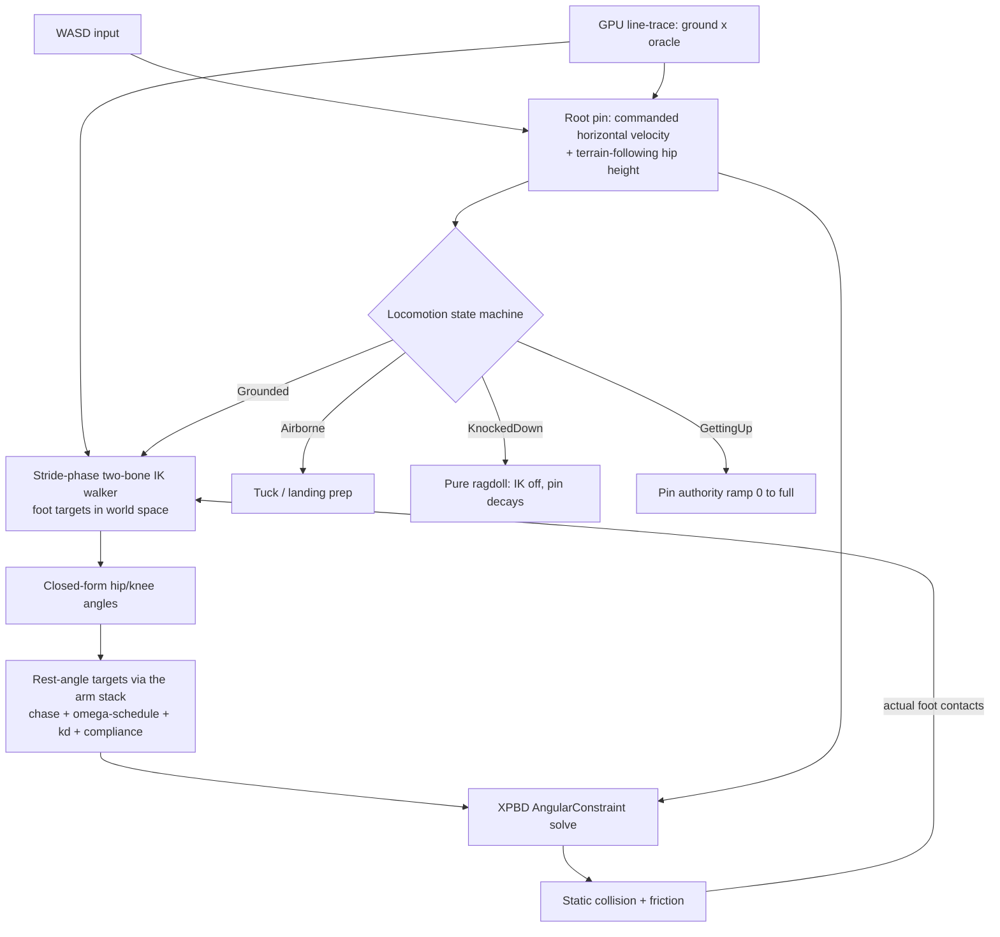

# Plan: Gravity + Walking for the Vello XPBD Character

> Status: **PLAN v2** (rewritten after design discussions; supersedes the
> SIMBICON/friction-driven version).
>
> **The one-sentence architecture:** gravity makes the body fall, the root pin
> *commands* the locomotion (Stick Fight style), and a stride-parameterized
> two-bone IK walker makes the legs *look like* they are producing that motion.
> Legs stay physical — XPBD rest-angle springs — so collision, shoves, ragdoll
> deaths, and tripping over corpses all work for free.
>
> References: Jakobsen — Advanced Character Physics (GDC 2001); the
> stride-phase IK walker pattern (Inside/Limbo, Rain World, Unity 2D Animation
> IK); SIMBICON (2007) kept only as vocabulary for the upright assist.
> Key advantage: pixel-accurate GPU line-trace on any collider gives us an
> exact `ground(x)` oracle for planned foot placement.

---

## 1. Goal

A character that falls under gravity, lands, stands, and walks with
**Stick Fight: The Game** feel:

- Movement is responsive and *commanded* — WASD gives direct horizontal root
  velocity. The character goes where you push the stick, every time.
- Legs are physical and follow the commanded motion; they bend around walls,
  land on debris, and flop correctly on death.
- Funny physics (TABS charm) comes from the *presentation* layer — ragdoll
  deaths, stumble-then-fall, tripping on clutter — not from making locomotion
  itself fragile.

Non-goals: force-driven balance (CoM feedback as the primary stabilizer),
learning/optimization, 3D, animation files (fully procedural — see §9).

### Why root-driven instead of friction-driven

TABS and Stick Fight are both Landfall games, but their locomotion differs:

| | TABS | Stick Fight | **Ours** |
|---|---|---|---|
| Horizontal motion | friction from gait-driven feet | direct root velocity authority | **direct root velocity** |
| Legs | physical, propulsion source | physical, following | **physical, following** |
| Tuning risk | high (4 coupled failure modes: slip, shuffle, fall-backward, oscillation) | low (commanded velocity is stable by construction) | low |
| Failure mode | falls over | degrades gracefully (legs lag, character still moves) | degrades gracefully |

Friction-driven walking is a closed-loop negotiation with the ground: mistune
any one of friction / gait timing / mass distribution / pin stiffness and the
character falls. Root-driven walking removes that entire failure class — the
root pin *is* the velocity, and the legs become a cosmetic problem: "make the
legs look like they produce this motion." That problem has a mature solution
(§5) and it is the same topology we already shipped for the arm: a target
(mouse point / root velocity) driving rest-angle springs.

Escape hatch: a `root_drive_weight` slider (0 = TABS friction-driven,
1 = Stick Fight). Ship at ~0.9; the last 0.1 keeps a whisper of ground
negotiation so shoves and slopes still perturb the root slightly.

---

## 2. Ground truth from the current code

1. **Gravity exists, but only reaches the soft body.** `GRAVITY` in
   `study_vello/integrations/vello_physics/src/collision_response.rs` is
   `Vec2::new(0.0, 98.0)` (Vello y-down: +y is "down"). Applied in
   `SoftBody::step()` via `apply_external_force(dt, gravity)`.
2. **The skeleton explicitly opts out.** `SoftBodyConnections` in
   `study_vello/.../soft_body_connection.rs` is annotated
   `// gravity free version`; `predict_positions()` has no `g·dt²` term.
3. **The spine pin currently does 100% of the "standing".**
   `tick_spine_drive()` holds `desired_center` / `desired_heading_upper` /
   `desired_heading_lower` via external position constraints.
4. **Collision + friction already exist.** `StaticCollisionConstraint` has a
   full normal + Coulomb-tangent solve (`friction_compliance`, `lambda_t`).
5. **The two-heading spine servo is the attitude pin.**
   `desired_heading_upper → up` (heading `-π/2` in y-down).
6. **Leg anchor frame reserved:** leg IK → P2–P3 frame. Leg topology:
   `P3 → P30/P31 → P40/P41 → PLLL/PRLL` (hip → knee → ankle/foot).
7. **The arm IK stabilization stack is shipped and tuned** (see
   `arm_ik_tuning.md`): length-normalized compliance, ω-scheduled compliance
   softening, kd velocity feedback (correct `+kd·ω` sign), α0.5
   interpolate-then-clamp rest chase, live egui sliders. The legs reuse all of
   it.
8. **`solve_reach_ik` already exists** in `character/ik.rs` — an analytic
   two-bone law-of-cosines IK. The leg walker is built on this exact pattern.

---

## 3. Architecture



Authority hierarchy (never violated): **leg spring authority < root pin
authority.** If the legs and the root ever disagree, the root wins and the
walker adapts (anchor-break rule, §5.4). This is what makes the system
unfallable by construction.

---

## 4. Phases

### Phase 0 — Enable gravity in the tuning app (one call)

Call `VelloConstraintWorld::set_gravity()` with `Vec2::new(0.0, 98.0)` in
`character_tuning_main.rs`.

**Accept:** soft bodies fall; the skeleton still floats — confirming the gap
is skeleton-side.

### Phase 1 — Feed gravity to the skeleton

- `SoftBodyConnections::predict_positions()`:
  `p.pos += p.velocity * dt + gravity * dt * dt` (mass-independent, matching
  `SoftBody::apply_external_force()`).
- Thread `gravity` from `ConstraintWorld::step()` — both parallel and
  non-parallel paths — into `SoftBodyConnections::step()`.

**Accept:** the whole character drops under gravity as a coherent unit.

### Phase 2 — The root pin becomes the locomotion driver (main event)

This phase replaces the old "soften the pin and let friction take over"
design. The pin is *strengthened*, not softened, and gains horizontal
authority:

- **Horizontal:** commanded velocity from WASD, applied to P2/P3 via the
  external position constraint path, using the same
  interpolate-then-clamp pattern as the spine drive (target = current +
  `v_cmd · dt`, clamped by a max step). Never pin the feet — feet belong to
  the walker.
- **Vertical:** `pin_vertical_weight` slider. While grounded, hip height =
  `ground_height(hip_x) + leg_rest_length` (§6), chased with a soft vertical
  spring so landings droop and rises are smooth. `pin_vertical_weight = 0`
  means full physical vertical (falls, jumps, knockback); > 0 biases toward
  terrain-following.
- **Death/hit transition:** `assist_decay` slider — on knockdown, pin
  authority ramps to 0 over ~0.3 s ("stumble, *then* fall"). Pure ragdoll at
  0.
- `root_drive_weight` slider as described in §1.

**Accept:** character stands on the floor, WASD moves it at commanded speed
with no drift, a shove displaces it and it recovers, death releases the pin
and it flops.

### Phase 3 — Friction (cosmetic role only)

Friction is no longer a propulsion mechanism. It exists for: planted-feet
grip (no ice-skating while the walker holds a stance anchor), shove response,
and sliding-on-corpse comedy. Tune `friction_compliance` in the mid-range
band (existing code comments already warn against super-small values). Add a
friction slider to the tuning UI.

**Accept:** stance foot does not skate; a hard shove breaks the step and the
character slides, then recovers.

### Phase 4 — The stride-parameterized two-bone IK walker

Replaces the old hip-oscillator/FSM gait. This is the mature pattern (Inside,
Limbo, Rain World): the hip is one particle with two two-bone legs; from the
side view it is literally the simplest form of IK, and we already have the
solver (`solve_reach_ik`).

#### 4.1 Stride clock (distance-driven, not time-driven)

```
phase += v_root · dt / stride_length      (mod 1)
left leg:  phase
right leg: phase + 0.5                     (antiphase)
```

Distance-driven cadence means the gait automatically matches ground speed —
no separate frequency tuning, no foot skating at speed changes (the plan's old
top risk, "leg PD oscillation," is structurally eliminated: there is no PD on
the gait at all, only on the rest-angle chase, which is already tuned).

#### 4.2 Stance foot — world-locked anchor

At touchdown, record the foot's **world position** as the stance anchor. The
stance leg's IK target stays fixed in the world while the hip moves away —
this foot-locking is the #1 rule of procedural walkers and the entire source
of "grip" feel. Re-record the anchor from the **actual** contact point (not
the planned one) so landing on corpses/debris self-corrects.

#### 4.3 Swing foot — quadratic Bézier arc

Swing target interpolates from the old anchor to the new planned landing
point (§6.2) along a quadratic Bézier with tunable apex height. Step length
scales with speed; apex scales with step length. Polish:

- **Soft-knee clamp:** cap leg extension at 0.95·(l₁+l₂) so the knee never
  fully straightens (hyperextension snap is the classic ugly artifact).
- **Hip bob:** vertical offset on the hip target = small sine at **2× stride
  frequency** (two bobs per cycle — one per step). Cheap, huge realism win.
- **Foot roll:** align the foot bone to the landing surface normal from the
  probe.

#### 4.4 IK → rest angles → XPBD

The walker outputs hip/knee **angles** (from the closed-form IK), which become
angular rest targets through the shipped arm stack:

- α0.5 interpolate-then-clamp chase (`max_angle_rate`),
- length-normalized compliance (`angular_compliance_at_length`),
- ω-scheduled compliance softening (same `omega_ref` / `soft_scale` idea —
  this is the antidote to swing-phase leg oscillation),
- kd velocity feedback — **swing phase only, small** (foot contact noise is
  much higher than arm noise, so the kd ceiling is lower; start at 0.02–0.05,
  never the arm's 0.1),
- **no dead zone** (do not port the arm's 1e-4 epsilon — legs move constantly).

Because the legs are driven by rest angles, collisions bend them naturally and
the spring restores — legs wrap around walls, kick obstacles, and go limp on
death with zero extra code.

#### 4.5 Anchor-break rule (the only "recovery" logic needed)

If `|hip − stance_anchor| > 0.95·(l₁+l₂)`, break the anchor and trigger an
immediate recovery step. This one rule handles: shoves, tripping, sliding,
stepping off ledges mid-stance. It is both the anti-stutter guard and the
natural shove response.

**Accept:** walking looks like walking at all speeds; feet plant and lift
cleanly; a shove mid-stride produces a recovery step, not a fall or a stutter.

### Phase 5 — Slope lean (aesthetic, small)

With root-driven locomotion, balance is not a control problem — Phase 5
shrinks to *looking right on slopes*:

```
slope = atan2(ground(x+δ) − ground(x−δ), 2δ)      // EMA-smoothed
desired_heading_upper = −π/2 + lean_k · slope
```

- `lean_k` 0.3–0.5, **asymmetric**: downhill lean-back stronger than uphill
  lean-forward (matches human intuition and reads funnier).
- Velocity-gated: no lean when standing still.
- EMA-smooth the slope (finite differences on curved colliders are noisy),
  then clamp total lean to ±25°.
- Use interpolate-then-clamp for the heading target (never snap).

**Accept:** character leans back going downhill, forward going uphill, and
does not jitter on curved terrain.

---

## 5. Locomotion state machine

```
Grounded ──(no contact / launched)──▶ Airborne
Airborne ──(foot contact)──▶ Grounded
any ──(lethal hit / big impulse)──▶ KnockedDown
KnockedDown ──(contact + input + timer)──▶ GettingUp ──▶ Grounded
```

### Grounded
Full walker (§4), full root pin, hip height terrain-following.

### Airborne
- Freeze the stride clock (or slow it); legs tuck slightly (knees bend toward
  a crouch pose).
- Soften leg compliance — reuse the ω-schedule mechanism (fast motion → soft).
- **Landing preparation:** when the probe sees ground within fall time, blend
  legs toward a landing crouch.
- **Touchdown:** foot-lock to the *real* contact point; `pin_vertical_weight`
  droops briefly then stiffens over ~0.2 s → free landing squat.

### KnockedDown
- IK off entirely (`IkMode::Disabled` equivalent for legs).
- Root pin released / decaying via `assist_decay` — "stumble then fall".
- Pure ragdoll. Optional tiny upright assist so bodies tend to end
  feet-oriented (comedic, tunable to 0).

### GettingUp
- No animation: ramp root pin authority 0 → full over ~0.3 s toward
  upright-above-hip.
- Gated on: ground contact + player input held + minimum down-time.
- Legs blend from crouch targets → walker targets as authority returns.

---

## 6. Terrain: the `ground(x)` oracle

The GPU line-trace gives pixel-accurate ground queries on any collider,
curved or straight. **CPU is the bottleneck, so probe only at step events**
(touchdown, step planning) and cache ground height from actual contacts
between events — not per frame per foot.

### 6.1 Hip height (implement first — one line of the pipeline)

```
hip_target_y = ground_height(hip_x) + leg_rest_length
```

Feeds Phase 2's vertical pin. Instantly fixes floating/sinking on slopes.

### 6.2 Planned foot placement

At each step event, plan the landing point *ahead*:

```
d_step = v_root · step_duration + stride_offset
landing = probe(hip_x + d_step)          // point + normal
```

- Verify the Bézier arc apex clears the terrain profile between stance and
  landing (probe 1–2 intermediate points only when the height delta is large).
- Step/ledge gating: if the landing height delta exceeds a max-step height,
  either raise the apex (step up) or refuse the step (ledge — trigger
  Airborne or a hand-hold later).
- **Crest detection:** if the probe ahead returns no ground within fall
  distance, briefly soften the root drive → the character goes airborne off
  the crest naturally (TABS comedy preserved).

### 6.3 Slope sampling

Per §5 (Phase 5): two probes around the hip, EMA-smoothed, velocity-gated.

---

## 7. Tuning plan

Methodology mirrors `arm_ik_tuning.md`: every regime boundary becomes a
slider; tune one knob at a time with debug visuals.

**Tuning order (do not skip ahead):**

1. Gravity + pin split (`pin_vertical_weight`, `root_drive_weight`) — stand
   and slide on flat ground with legs dangling.
2. Friction — planted feet grip.
3. Stance hold — anchor + anchor-break rule, no swing yet (drag the character
   around by root, legs should trail and plant).
4. Walker with ω-schedule ON, **kd = 0** — full gait. Fix any oscillation
   with the schedule (`omega_ref`, `soft_scale`) and compliance, not kd.
5. kd last, swing-phase only, small — shimmer test as in the arm guide (raise
   until rest jitter appears, back off 2×).

**New sliders:** `root_drive_weight`, `pin_vertical_weight`, `assist_decay`,
`stride_length`, `step_apex`, `hip_bob_amount`, `soft_knee_scale`,
`lean_k_uphill` / `lean_k_downhill`, `max_step_height`, plus the leg
`LegConfig` mirrors of `ArmConfig` (compliance, `compliance_ref_length`,
`omega_ref`, `soft_scale`, `kd`, `kd_max_offset`, `max_angle_rate`).

**Debug visuals:** stance anchors, planned landing points + normals, Bézier
arc, stride phase bar, state machine label.

**Symptom → knob table (corrected — the old table blamed "damping too low"
for rest jitter; the arm work proved jitter is usually kd or noise):**

| Symptom | Likely cause | Knob |
|---|---|---|
| Feet rest-jitter / shimmer | kd too high, or compliance too stiff vs. solver noise | leg `kd` ↓, `angular_compliance` ↑ |
| Foot skate in stance | anchor moving with hip, or friction too low | check anchor is world-locked; `friction_compliance` |
| Leg oscillation during swing | ω-schedule off or too weak | `soft_scale` ↑, `omega_ref` ↓ |
| Knee snap at full extension | no soft-knee clamp | `soft_knee_scale` (0.95 default) |
| Gait looks rushed / laggy vs. speed | stride clock time-driven or stride_length wrong | `stride_length` |
| Character stutters when shoved | anchor-break threshold too high | lower break threshold (0.95·(l₁+l₂)) |
| Jitter on curved slopes | raw finite-difference slope | slope EMA ↑ |
| Falls backward on shove | leg authority ≥ root authority (hierarchy violated) | re-check §3 inequality; `root_drive_weight` ↑ |
| Landing is stiff / robotic | no vertical droop on touchdown | `pin_vertical_weight` droop timing |

---

## 8. Sign convention warning (the bug that cost a session)

`cos_sin(p0, p1, p2)` computes `sin = u1.y·u2.x − u1.x·u2.y = −cross(u1, u2)`,
so the constraint angle is **θ = φ_in − φ_out** (incoming minus outgoing bone
angle). `bone_angular_velocity` measures ω = dφ_out/dt of the **outgoing**
bone, therefore **θ̇ = −ω**, and the textbook damping term `−kd·θ̇` becomes
**`+kd·ω`** in our constraint space. Getting this backwards creates positive
velocity feedback (energy pump → forever swinging).

For the legs: add a single `joint_angle_rate()` helper that returns the
constraint-space rate directly (sign-safe by construction), so every future
joint consumer cannot get this wrong. Also remember: kd·ω is
**time-independent** — kd has units of seconds and must never be multiplied by
dt.

---

## 9. No animation files — fully procedural, by design

Animation files solve problems we do not have:

- **High joint count** — our entire gait is ~5 numbers (stride phase, two hip
  angles, two knee angles) plus a foot normal.
- **Authored feel** — we want physics-y feel, which *is* the slider set.
- **Blend trees** — the compliance springs are the blender: they yield
  correctly to collisions mid-blend, which a keyframe mixer cannot do.

What we skip: retargeting, sync marks, root-motion extraction, ragdoll-blend
seams. If a signature move is ever needed, it is a handful of keyframed angle
waypoints fed through the same rest-angle chase — still not skeletal
animation.

The arm is the working proof of concept: same topology (target → closed-form
IK → rest angles → XPBD springs), shipped and stable.

---

## 10. File touch list

| File | Change |
|---|---|
| `study_vello/.../soft_body_connection.rs` | gravity in `predict_positions` + `step` signature |
| `study_vello/.../collision_response.rs` | pass gravity into connection step (both cfg paths) |
| `bevy_vello/.../character/mod.rs` | `LegController` + `LegConfig` (mirror of `ArmConfig`), `LocomotionState`, root-drive config |
| `bevy_vello/.../character/systems.rs` | `calculate_leg_ik` (stride walker + `solve_reach_ik` reuse), root-pin velocity drive in `tick_spine_drive`, `joint_angle_rate()` helper, slope lean term |
| `bevy_vello/.../character/ik.rs` | reuse/extend `solve_reach_ik` for legs (soft-knee clamp) |
| `bevy_vello/.../character_tuning_main.rs` | `set_gravity`; new sliders; walker debug visuals |
| ray-trace bridge | wrap existing line-trace as `ground_probe(x)` returning point + normal, event-driven (step events only) |

---

## 11. Risks & fallbacks

- **Legs fight the root pin** (character vibrates or lurches): authority
  hierarchy violated. Fallback: raise `root_drive_weight` to 1.0 and lower leg
  spring stiffness until calm, then re-balance. This is the primary risk and
  it is a pure slider fix by construction.
- **Gait looks mechanical on uneven terrain:** planned placement (§6.2) is
  the fix; worst case fall back to blind anchors re-recorded from actual
  contacts (still fine on gentle terrain).
- **kd shimmer on legs:** contact noise ceiling is lower than the arm's.
  kd = 0 is a completely acceptable shipping value for legs — the ω-schedule
  does the real damping work.
- **Probe cost (CPU bottleneck):** event-driven probing only; if still
  expensive, cache `ground_height` from actual foot contacts and probe only
  for *planned* landings.
- **Position-pin vs floor fight on landing:** `pin_vertical_weight` droop
  (§5 Airborne→touchdown) is the release valve; keep it a slider so it is
  reversible.
- **Scope creep into force-driven balance:** explicitly out. The root pin is
  the balance; CoM feedback may return later only as *aesthetic* sway.
