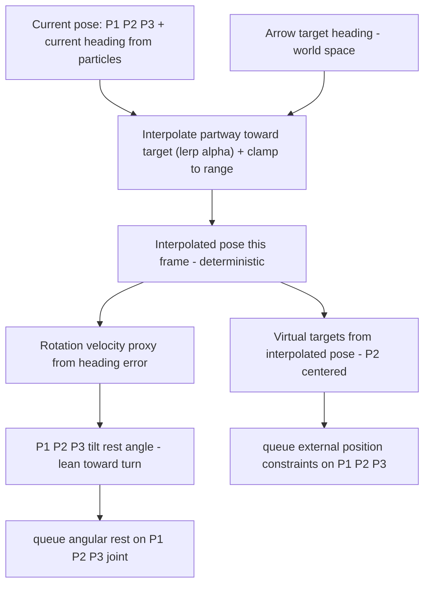

# Procedural Spine Targeting System

Status: **Draft for review** · Area: character control (spine drive)

## Goal

Replace the freely-draggable mouse handle with a **procedural targeting system** driven by arrow keys. The character's head/heading is commanded in world space; the spine is steered and leaned toward the target via the existing damped external position constraints + angular constraints, giving a controllable feel.

## Scope / non-goals

- Only the three tracked spine particles **P1, P2, P3** are considered (`SpineController.particles[2..=4]`). All other particles are ignored for this discussion.
- Tilt (rest-angle lean) applies **only** to the `P1_P2_P3` angular joint (`SpineController.angulars[2]`).
- The same "faster rotation → bigger tilt" rule-of-thumb for `P0_P1_P2` is acknowledged but **out of scope** here.
- Position constraints target P1/P2/P3 via the existing `queue_character_one_time_external_position_constraint`.

## Core invariant (hard requirement)

The controller is effectively a **pure function** of current state + player input:

```
f( P1, P2, P3 pose, current heading, player arrow input ) -> ( virtual targets, P1_P2_P3 rest angle )
```

If the three particles are byte-identical to the previous frame and the player input is unchanged, the computed output **must be identical** to the previous frame's output.

Consequences:
- **No stateful / accumulated values** in the controller (no time-integrated velocity, no stored smoothed rotation/position that drifts independently of particle state).
- "Rotation velocity" (used to scale lean) must be **derived from current state**, e.g. from the heading error, not from a time history.
- The interpolated pose must itself be a purely re-derived function of state + input.
- This makes the whole controller **unit-testable** as a pure function (feed identical inputs, assert identical outputs).

## Architecture

The indicator stays as the thin input + visualization front-end; a controller module owns the pose/target math.



### Pieces

1. **Input (existing [`spine_indicator.rs`](bevy_vello/examples/collision_detection/src/spine_indicator.rs:190))**
   - Arrow keys set the **target heading** in world space (right arrow → head points right).
   - Channel through the existing `SpineIndicator`/`IndicatorControl` resources; the visual is updated to reflect the commanded heading rather than a freely dragged handle.

2. **Current state (from live particles only)**
   - Center = `P2` world position (mid-spine) — shared with the `BalancedCoreFrame` origin / collision pivot from the mid-spine work.
   - Current heading = angle of `P3 − P1` (within the tracked trio). *(confirmed baseline)*

3. **Virtual pose (new controller, [`character/systems.rs`](bevy_vello/examples/game_lib/src/character/systems.rs) or new module)**
   - `target_pose = (P2 center, arrow heading)`.
   - Per frame, re-derive an **interpolated pose** from current state toward target (see **Interpolation / damping** below).
   - Clamp the interpolated pose "within range".

4. **Lean / tilt (new math, deterministic)**
   - From heading error (proxy for rotation velocity), compute a rest-angle lean for `P1_P2_P3`, leaning toward the rotating/turn direction.
   - Queued via `queue_character_angular_constraints` → `set_connect_angular_config` (`rest_cos`/`rest_sin`).

5. **Drive (reuse existing plumbing)**
   - External position constraints: reuse the `compute_bevy_targets` shape (translate + rotate P2-centred local offsets) fed by the **interpolated** pose. P2's virtual target = interpolated center.
   - Angular constraint: set the lean rest pose on `P1_P2_P3`.
   - Physics damping on P1/P2/P3 (existing solver behavior) is the second, time-backed smoothing layer that turns the interpolated pose into controllable motion.

## Interpolation / damping (RESOLVED)

> **Mechanism.** There is no time-based ease-in/ease-out curve, because the target is re-derived every frame and determinism forbids accumulated time. Instead we **always interpolate partway toward a fixed/held target each frame, clamped by max speed**, and rely on the resulting asymptotic approach as the damping/ease-out.

### Worked example (position, 90 fps)

- **Max-speed cap** bounds the per-frame step: `max_speed` (px/s) × `dt` → e.g. 900 px/s at 90 fps = **10 px/frame**. The virtual point must never exceed this per-frame displacement (the character's virtual point can't teleport faster than max speed).
- **Command (press right):** place the target 40 px away from the current center. `mid = lerp(current, target, α)` returns 20 px (α = 0.5). Clamp the resulting step into the allowed per-frame band — effectively between 10 px and 20 px — tuned by the **stiffness of the external distance constraint** (stiffer constraint ⇒ tighter cap toward the low end). So the virtual point advances at most the per-frame max.
- **Release:** the target is **frozen** at the last commanded pose (it does **not** snap back to the current pose). We keep interpolating the virtual point toward that fixed target each frame, asymptotically closer but **never reaching** it — this continuous decay **is** the damping.

### Per-frame computation (position and heading follow the same pattern)

```
step = target - current                      # commanded delta
mid  = current + α * step                    # interpolate partway (α in (0,1))
step_len = |mid - current|                   # candidate per-frame displacement
pose = current + clamp_dir( step, 0, max_step )   # clamp to [0, max_step] along step direction
# (for angle: same but with max_step = ang_max_speed * dt, plus the heading range clamp)
```

- Because `current` re-derives from the live particles each frame and we take only a fraction `α` of the remaining gap, we get **asymptotically closer to the target but never reach it** — this is the ease-out / damping.
- **On release** the target freezes at the last commanded pose; the virtual point keeps decaying toward it, and the physics damping settles the particles cleanly. Nothing snaps back.
- Fully deterministic: `mid` is a pure function of `(current, target, dt)`. Unit-testable.
- Position and rotation each use their own `α` and their own `max_speed`, so linear and angular response are tuned independently.

This is what was previously labelled "ease-in-out". The lingering "ease-in" notion is **retired**: with a fresh start every frame it degenerates into the monotonic decay above, and a slow-start on large error would only make the character feel unresponsive to big commands.

## Constants / tuning knobs

- `pos_alpha` — interpolation factor per frame for the target center position.
- `ang_alpha` — interpolation factor per frame for the target heading angle.
- `max_pos_speed` — max center speed in px/s; `max_pos_step = max_pos_speed * dt` is the per-frame position cap.
- `max_ang_speed` — max heading turn rate in rad/s; `max_ang_step = max_ang_speed * dt` is the per-frame angular cap.
- `command_reach` — how far ahead of the current center the commanded target is placed (e.g. 40 px). The **rotation axis works identically**: a commanded heading offset that likewise introduces a small, controlled lag/damping phase (the angular analogue of the 40 px slow-down).
- `lean_gain` — maps **per-frame angular step (rotation speed this frame)** → `P1_P2_P3` rest-angle lean. Faster actual turn ⇒ bigger lean.
- Existing `SpineConfig.{compliance, damping}` and the angular compliance drive the physics-side smoothing.

## Files

- [`spine_indicator.rs`](bevy_vello/examples/collision_detection/src/spine_indicator.rs) — input/visual: arrows set target heading; indicator reflects commanded pose (adjust, not rewrite).
- [`spine_position_constraint.rs`](bevy_vello/examples/collision_detection/src/spine_position_constraint.rs:66) — extend to also queue the `P1_P2_P3` angular lean from the computed pose.
- New controller module (game_lib `character/`) or extend [`character/systems.rs`](bevy_vello/examples/game_lib/src/character/systems.rs) with the pure pose/lean math + unit tests.
- Active scene [`character_tuning_main.rs`](bevy_vello/examples/collision_detection/src/character_tuning_main.rs:172) wiring: arrow input already flows via `IndicatorControl::Arrow`; ensure `spine_position_constraint` picks up the new pose/lean.

## Tests

- Pure-function unit tests: identical (particles, input) ⇒ identical (pose, lean).
- Interpolation/damping tests: `current + α·(target − current)` clamped to `max_step`; monotonic toward target, never overshoots; per-frame step never exceeds `max_speed · dt`; frozen target on release keeps decaying asymptotically (never reaches); clamp in-range and out-of-range cases.
- Lean sign/orientation: target right ⇒ +bend; symmetric for left.
- Existing `vello_physics` / `game_lib` suites must remain green.

## Resolved decisions

- **Heading clamp**: rotation works exactly like position — a **per-frame max turn step** (`max_ang_step = max_ang_speed · dt`), no absolute heading range. It introduces a small controlled lag (the angular analogue of the 40 px slow-down phase).
- **Lean driver**: the `P1_P2_P3` rest-angle lean is based on **rotation speed**, i.e. the interpolated per-frame angular step actually applied this frame (rad/frame → turn rate); `lean_gain` maps it to the rest angle. Orientation: target to the character's right ⇒ `P1_P2_P3` bends toward its right (+), symmetric for left.

## Open questions

*None — both prior open questions are resolved (see above).*