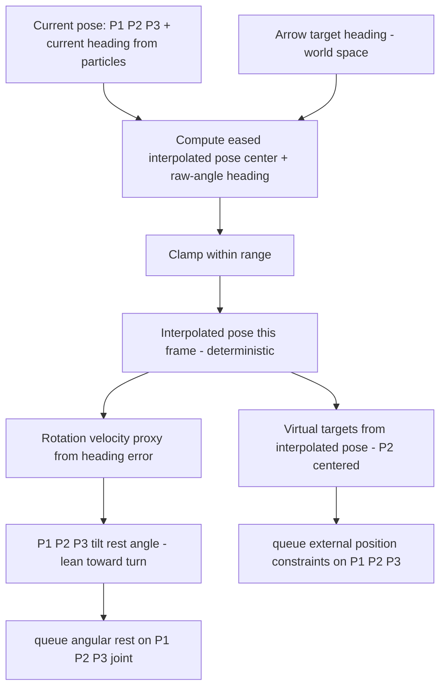

# Procedural Spine Targeting System

Status: **Draft for review** · Area: character control (spine drive)

## Goal

Replace the freely-draggable mouse handle with a **procedural targeting system** driven by arrow keys. The character's head/heading is commanded in world space; the spine is steered and leaned toward the target via the existing damped external position constraints + angular constraints, giving a controllable feel.

## Scope / non-goals

- Only the three tracked spine particles **P1, P2, P3** are considered (`SpineController.particles[2..=4]`). All other particles are ignored for this discussion.
- Tilt (rest-angle lean) applies **only** to the `P1_P2_P3` angular joint (`SpineController.angulars[2]`).
- The same "faster rotation → bigger tilt" rule-of-thumb for `P0_P1_P2` is acknowledged but **out of scope** here.
- Position constraints target P1/P2/P3 via the existing `queue_character_one_time_external_position_constraint`.

## Core invariant (hard requirement)

The controller is effectively a **pure function** of current state + player input:

```
f( P1, P2, P3 pose, current heading, player arrow input ) -> ( virtual targets, P1_P2_P3 rest angle )
```

If the three particles are byte-identical to the previous frame and the player input is unchanged, the computed output **must be identical** to the previous frame's output.

Consequences:
- **No stateful / accumulated values** in the controller (no time-integrated velocity, no stored smoothed rotation/position that drifts independently of particle state).
- "Rotation velocity" (used to scale lean) must be **derived from current state**, e.g. from the heading error, not from a time history.
- The eased/interpolated pose must itself be a purely re-derived function of state + input.
- This makes the whole controller **unit-testable** as a pure function (feed identical inputs, assert identical outputs).

## Architecture

The indicator stays as the thin input + visualization front-end; a controller module owns the pose/target math.



### Pieces

1. **Input (existing [`spine_indicator.rs`](bevy_vello/examples/collision_detection/src/spine_indicator.rs:190))**
   - Arrow keys set the **target heading** in world space (right arrow → head points right).
   - Channel through the existing `SpineIndicator`/`IndicatorControl` resources; the visual is updated to reflect the commanded heading rather than a freely dragged handle.

2. **Current state (from live particles only)**
   - Center = `P2` world position (mid-spine) — shared with the `BalancedCoreFrame` origin / collision pivot from the mid-spine work.
   - Current heading = angle of `P3 − P1` (within the tracked trio). *(confirmed baseline)*

3. **Virtual pose (new controller, [`character/systems.rs`](bevy_vello/examples/game_lib/src/character/systems.rs) or new module)**
   - `target_pose = (P2 center, arrow heading)`.
   - Per frame, re-derive an **eased interpolated pose** from current state toward target.
   - **Distance-based** easing for the center; **angle-based** easing for the heading (raw angle).
   - Clamp the interpolated pose "within range".

4. **Lean / tilt (new math, deterministic)**
   - From heading error (proxy for rotation velocity), compute a rest-angle lean for `P1_P2_P3`, leaning toward the rotating/turn direction.
   - Queued via `queue_character_angular_constraints` → `set_connect_angular_config` (`rest_cos`/`rest_sin`).

5. **Drive (reuse existing plumbing)**
   - External position constraints: reuse the `compute_bevy_targets` shape (translate + rotate P2-centred local offsets) fed by the **interpolated** pose. P2's virtual target = interpolated center.
   - Angular constraint: set the lean rest pose on `P1_P2_P3`.
   - Physics damping on P1/P2/P3 (existing solver behavior) is the second, time-backed smoothing layer that turns the eased pose into controllable motion.

## Ease-in-out interpolation — TO BE CONFIRMED

> **Open question.** A conventional `smoothstep(t)` needs elapsed time, which is forbidden by the determinism invariant. The proposed resolution is **error-based easing**: no accumulated `t`; each frame the correction step is shaped purely by the current error magnitude.

Position uses `dist = |target_center − current_center|`; rotation uses the angular error `Δθ` between current heading and target heading.

Three candidate shapes (bounded by "no time" constraint):

- **A. Proportional** `new = current + k·(target − current)`: iterated → exponential, **ease-out only**, never eases in. Simple/stable; does not meet "ease-in AND ease-out".
- **B. Bell over normalized error** (recommended): `u = clamp(error / L, 0, 1)`, `rate = g(u)` peaked at `u = 0.5`, e.g. `4·u·(1−u)` or composed smoothstep; step = `max_step · rate` along the error direction. Genuine ease-in-out, deterministic, pure. **Pitfall:** `rate → 0` at very large error (`u → 1`); pick `L` as practical max error / taper tails gracefully.
- **C. Eased proportional** `step = k0 · shaped(u) · (target − current)`: smoothed proportional, approximates ease-out unless the far end is also bent.

Split easing per axis: linear `L` ("easing length") and angular `L_θ` ("easing angle") as tunable constants.

## Constants / tuning knobs (proposed, to confirm with implementation)

- `easing_length` — characteristic position error for the position ease.
- `easing_angle` — characteristic heading error for the angle ease.
- `max_pos_step` — max per-frame target center displacement.
- `max_ang_step` — max per-frame target heading change.
- `lean_gain` — maps heading error → `P1_P2_P3` rest-angle lean.
- Existing `SpineConfig.{compliance, damping}` and the angular compliance drive the physics-side smoothing.

## Files

- [`spine_indicator.rs`](bevy_vello/examples/collision_detection/src/spine_indicator.rs) — input/visual: arrows set target heading; indicator reflects commanded pose (adjust, not rewrite).
- [`spine_position_constraint.rs`](bevy_vello/examples/collision_detection/src/spine_position_constraint.rs:66) — extend to also queue the `P1_P2_P3` angular lean from the computed pose.
- New controller module (game_lib `character/`) or extend [`character/systems.rs`](bevy_vello/examples/game_lib/src/character/systems.rs) with the pure pose/lean math + unit tests.
- Active scene [`character_tuning_main.rs`](bevy_vello/examples/collision_detection/src/character_tuning_main.rs:172) wiring: arrow input already flows via `IndicatorControl::Arrow`; ensure `spine_position_constraint` picks up the new pose/lean.

## Tests

- Pure-function unit tests: identical (particles, input) ⇒ identical (pose, lean).
- Easing shape tests: bell peaks at mid error; zero step at error 0; bounds respected.
- Lean sign/orientation: target right ⇒ +bend; symmetric for left.
- Existing `vello_physics` / `game_lib` suites must remain green.

## Open questions

1. **Easing shape**: A, B, or C (see above). Recommend **B**.
2. **Clamp semantics**: does "clamp within range" bound (a) per-frame step toward target, (b) absolute heading range, or both?
3. **Lean driver**: angular error vs. eased per-frame angular step (see discussion) — and sign/orientation confirmation (symmetry assumed).