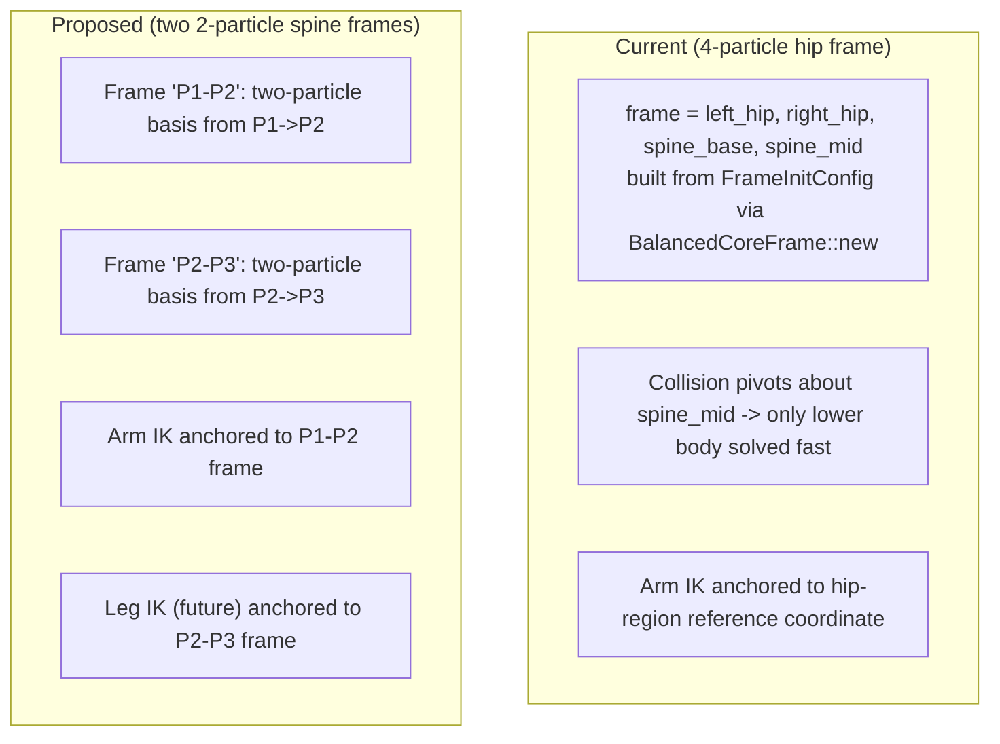
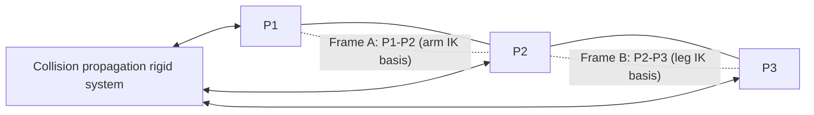

# Two-Particle Spine Reference Frames (Design Realization)

> Status: DESIGN — no code yet. Captures a realization about how the rigid collision
> frame, the reference coordinates, and the IK anchors should be restructured.

## Goal

Replace the 4-particle hip-based reference frame with **two 2-particle spine frames**
(P1–P2 and P2–P3), fix the fact that rigid collision propagation currently only solves
the *lower* body while the upper body lags, and repoint IK to the correct spine segment.

## The three realizations

### 1. Collision must not be treated differently for upper vs lower body

The rigid collision applied to the frame is meant to solve **slow propagation** — instead of
letting a collision diffuse particle-to-particle through the constraint chain over many frames,
the rigid frame absorbs it immediately and redistributes it rigidly.

The problem: the current frame is **hip-based** (`[left_hip, right_hip, spine_base, spine_mid]`,
see [`FrameInitConfig`](../study_vello/integrations/vello_physics/src/lib.rs:303) and
[`apply_rigid_offset_to_frame`](../study_vello/integrations/vello_physics/src/utility.rs:867)),
which pivots about the waist. That decomposition **only fast-solves the lower body**. The upper
body (the spine/torso P1/P2/P3 region and the arms) is not part of that rigid frame, so it still
lags — collision reaches it only through the slow particle/constraint diffusion the rigid frame
was supposed to eliminate.

**This is wrong.** A collision force should reach the upper body just as fast as the lower body,
with the same rigid decomposition. The rigid propagation needs to be about the **whole spine**,
not just the hips.

### 2. Two particles are enough to build a reference coordinate

You do not need four particles to define a reference frame. A `BalancedCoreFrame` is ultimately
just an orthonormal basis + an origin:

- basis_y = normalized segment direction
- basis_x = perpendicular (90° CCW in the y-down convention)
- origin = one of the two endpoints (the segment's local (0,0))

Two particles fully determine that. The current `[hip_left, hip_right, spine_base, spine_mid]`
frame uses the spine direction (`spine_mid − spine_base`) for basis_y but drags in all four
positions and two extra angle conventions. That is over-parameterized and is what couples the
frame to the hip/skeleton topology that doesn't belong in a spine reference.

A **P1–P2** segment and a **P2–P3** segment each give a clean two-particle basis. The spine is
composed of exactly these two adjacent segments (P1→P2 and P2→P3, with P2 the shared pivot), so
building one `BalancedCoreFrame` per segment covers the whole spine with the minimal data.

### 3. IK must anchor to the spine segment, not the hip region

It is currently **wrong** to build the reference coordinate from the hip region for **arm IK**.
The arms attach to the spine at P1; their world-space behavior should track the motion/orientation
of the **P1–P2 segment** (the upstream spine bone the arm hangs from). Anchoring arm IK to a
hip-derived basis injects unwanted hip sway and disconnects the arm from the spine motion that
actually carries it.

- **Arm IK** → use the **P1–P2** frame.
- **Leg IK** (future, e.g. walking on a surface) → use the **P2–P3** frame.

This makes each limb track the spine segment it is mechanically attached to, keeping IK, the
visual spine, and the physics spine consistent under both user input and collision.

## Proposed structure

- Two `BalancedCoreFrame`s:
  - `frame_p1p2` built from `{P1, P2}` — basis along P1→P2, origin at P2 (or P1 per convention).
  - `frame_p2p3` built from `{P2, P3}` — basis along P2→P3, origin at P2 (or P3 per convention).
- Rigid collision propagation re-pointed at the **spine particles** (P1/P2/P3) so both the lower
  and upper spine receive the same fast rigid decomposition — no upper-body lag.
- Arm IK uses `frame_p1p2`; future leg IK uses `frame_p2p3`.

## Open questions (to resolve before implementation)

1. **Pivot choice.** For each two-particle frame, which endpoint is the origin/(0,0)? The segment
   midpoints and the shared P2 pivot both matter for how collision torque and IK anchors read.
2. **Collision frame particle set.** Does the rigid propagation continue to use the 4 frame
   particles but recompute them from P1/P2/P3, or is a new two-particle rigid propagation built
   for each segment?
3. **Arm attach correction.** Confirm the arm IK currently reads the hip-derived basis and the
   exact call site to repoint to `frame_p1p2`.
4. **Back-compat.** The `FrameInitConfig` / `BalancedCoreFrame::new(hip_left, hip_right, spine_base,
   spine_mid)` API is used by the character generator and collision-response assembly — whether to
   extend or migrate to the two-particle form.

## Notes

- No code written for this yet; this document captures the direction.
- The earlier spine-let-go idle damping work (`spine_idle_let_go_plan.md`) and this restructuring are
  related but distinct: this fixes the *collision propagation topology*; that addressed the *idle
  damping vs collision* interaction. This restructuring may itself reduce the upper-body lag that
  motivated compensating impulses, so it should be revisited together.

## Original statement (verbatim)

> don't write any code, just write the idea in to a document for now, the realization is
> firstly it is wrong the treate collision differently for upper body and lower body. the rigid
> collision applied to the frame are suppose for solving slow propergation but currently it only
> sovles the lower body, the upper body would still be lagging for collision. secondly, you we
> don't need four particles to build a referecen coordiante two is enough. thirdly, it is
> actually wrong to use the reference coordiante from the hip region for arm ik logic. we should
> use the P1 P2 one. and have leg ik use thet P2 P3 one if we want to have the character walks
> some surface in the future.