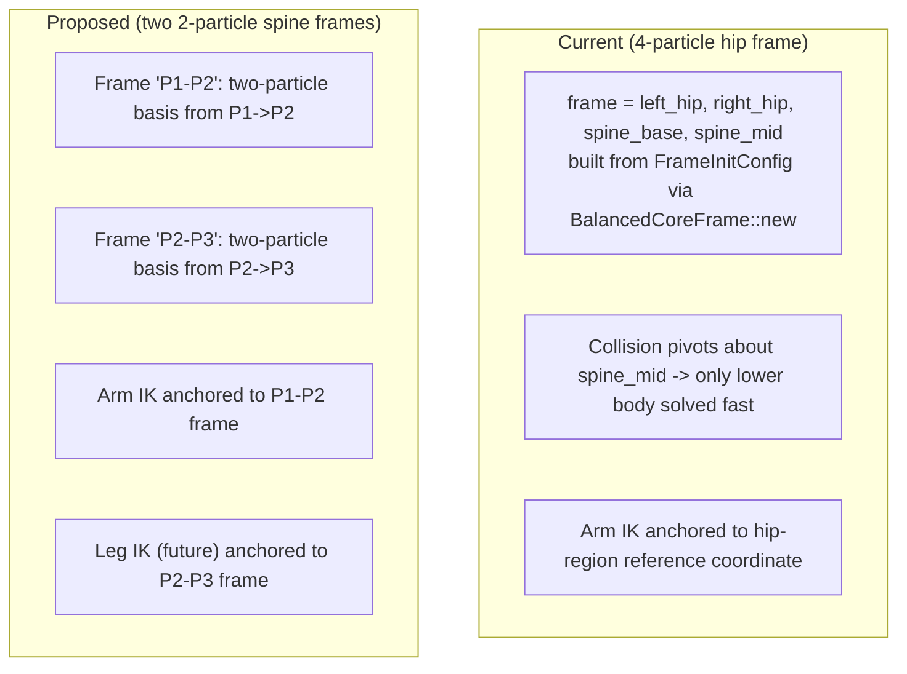
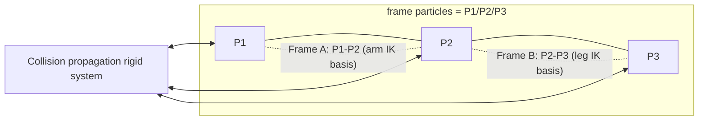

# Two-Particle Spine Reference Frames (Design Realization)

> Status: DESIGN — no code yet. Captures a realization about how the rigid collision
> frame, the reference coordinates, and the IK anchors should be restructured.

## Goal

Replace the 4-particle hip-based reference frame with **two 2-particle spine frames**
(P1–P2 and P2–P3), treat **P1/P2/P3 as the frame particles** (the whole spine is the rigid
unit), fix the fact that rigid collision propagation currently only solves the *lower* body
while the upper body lags, add the extra skeleton-particle impulse routed through the same
rigid transform, and repoint IK to the correct spine segment.



## The three realizations

### 1. Collision must not be treated differently for upper vs lower body

The rigid collision applied to the frame is meant to solve **slow propagation** — instead of
letting a collision diffuse particle-to-particle through the constraint chain over many frames,
the rigid frame absorbs it immediately and redistributes it rigidly.

The problem: the current frame is **hip-based** (`[left_hip, right_hip, spine_base, spine_mid]`,
see [`FrameInitConfig`](../study_vello/integrations/vello_physics/src/lib.rs:303) and
[`apply_rigid_offset_to_frame`](../study_vello/integrations/vello_physics/src/utility.rs:867)),
which pivots about the waist. That decomposition **only fast-solves the lower body**. The upper
body (the spine/torso P1/P2/P3 region and the arms) is not part of that rigid frame, so it still
lags — collision reaches it only through the slow particle/constraint diffusion the rigid frame
was supposed to eliminate.

**This is wrong.** A collision force should reach the upper body just as fast as the lower body,
with the same rigid decomposition. The rigid propagation needs to be about the **whole spine**,
not just the hips.

### 2. Two particles are enough to build a reference coordinate

You do not need four particles to define a reference frame. A `BalancedCoreFrame` is ultimately
just an orthonormal basis + an origin:

- basis_y = normalized segment direction
- basis_x = perpendicular (90° CCW in the y-down convention)
- origin = one of the two endpoints (the segment's local (0,0))

Two particles fully determine that. The current `[hip_left, hip_right, spine_base, spine_mid]`
frame uses the spine direction (`spine_mid − spine_base`) for basis_y but drags in all four
positions and two extra angle conventions. That is over-parameterized and is what couples the
frame to the hip/skeleton topology that doesn't belong in a spine reference.

A **P1–P2** segment and a **P2–P3** segment each give a clean two-particle basis. The spine is
composed of exactly these two adjacent segments (P1→P2 and P2→P3, with P2 the shared pivot), so
building one `BalancedCoreFrame` per segment covers the whole spine with the minimal data.

### 3. IK must anchor to the spine segment, not the hip region

It is currently **wrong** to build the reference coordinate from the hip region for **arm IK**.
The arms attach to the spine at P1; their world-space behavior should track the motion/orientation
of the **P1–P2 segment** (the upstream spine bone the arm hangs from). Anchoring arm IK to a
hip-derived basis injects unwanted hip sway and disconnects the arm from the spine motion that
actually carries it.

- **Arm IK** → use the **P1–P2** frame.
- **Leg IK** (future, e.g. walking on a surface) → use the **P2–P3** frame.

This makes each limb track the spine segment it is mechanically attached to, keeping IK, the
visual spine, and the physics spine consistent under both user input and collision.

## Terminology change: P1/P2/P3 become the frame particles

Going forward we will call **P1/P2/P3 our frame particles** (instead of the hip-based
`[left_hip, right_hip, spine_base, spine_mid]`). The spine control particles and the rigid
collision frame become the same set — the whole spine is the rigid unit, and the reference
coordinates are built from its own segments.

## Proposed structure



- Two `BalancedCoreFrame`s built from the frame particles:
  - `frame_p1p2` built from `{P1, P2}` — basis along P1→P2, origin at P2 (or P1 per convention).
  - `frame_p2p3` built from `{P2, P3}` — basis along P2→P3, origin at P2 (or P3 per convention).
- Rigid collision propagation re-pointed at the **frame particles** (P1/P2/P3) so both the lower
  and upper spine receive the same fast rigid decomposition — no upper-body lag.
- Arm IK uses `frame_p1p2`; future leg IK uses `frame_p2p3`.

## Extra impulse on the skeleton particles (compensation)

Details to fold in (from the earlier idle-damping discussion):

- The idle damping shaves collision-derived velocity, which makes collision feel weaker at the
  skeleton. To compensate, we add an **extra impulse on the skeleton particles**.
- Because P1/P2/P3 are now both the spine control particles **and** the frame particles, this
  extra impulse must be **routed through the same rigid frame decomposition** as collision — i.e.
  added as an offset/impulse site in the frame aggregation so it breaks into the same
  `linear + ω × r` (translation + rotation about P2) response that collision uses.
- This keeps the collision response and the compensating impulse consistent: both apply the same
  rigid transform to the whole P1/P2/P3 frame rather than treating P2 or individual particles
  differently.

## Rigid transform applied to P1/P2/P3

The collision (and the extra compensating impulse) performs a **rigid transform of the whole
P1/P2/P3 set** — not just a push on P2:

- a linear term applies equal translation to P1, P2, P3;
- an angular term (about the P2 pivot) applies a rotation that moves P1 and P3 by their lever arms
  from P2, rotating the frame as a unit.

So collision and impulse both rigidly transform the entire P1/P2/P3 frame, keeping the spine a
consistent rigid unit under user input and external forces.

## The four-level hierarchy (frame → appendages → coarse → fine)

P1/P2/P3 as the root engine frame slots into a four-level hierarchy where each level is driven
**one-way** by the level above it. The P1–P2–P3 core spine is the authoritative root; everything
below it follows, never feeds back.

```text
[ LEVEL 1: THE ROOT ENGINE FRAME ]  ──►  P1-P2-P3 Core Spine
                 │                          - Stiff tracking, leashes, velocity caps
                 ▼                          - Bidirectional internal constraints
  [ LEVEL 2: SKELETON APPENDAGES ]   ──►  Arms, Legs, Head Particles
                 │                          - Driven by relative angular constraints
                 ▼ (One-Way)
  [ LEVEL 3: COARSE SOFTBODY FRAMES] ──►  Structural Rectangular Softbody Cages
                 │                          - Follows skeleton perfectly, manages bulk mesh volume
                 ▼ (One-Way)
  [ LEVEL 4: FINE DETAIL SHAPES ]    ──►  Precise Bézier Skin Contours
                                           - Ultra-fluid, high-resolution rendering mesh
```

- **Level 1 (root engine frame):** the P1/P2/P3 core spine. Stiff tracking, leashes, and velocity
  caps; internal constraints are *bidirectional* (the frame solves itself as a rigid unit).
- **Level 2 (skeleton appendages):** arms, legs, head particles. Driven *one-way* by relative
  angular constraints anchored to the Level-1 spine segments (arm IK from P1–P2, leg IK from
  P2–P3). They follow the root frame.
- **Level 3 (coarse softbody frames):** the structural rectangular softbody cages. Follow the
  skeleton perfectly and manage the bulk mesh volume; driven one-way by Level 2.
- **Level 4 (fine detail shapes):** the precise Bézier skin contours — the ultra-fluid,
  high-resolution rendering mesh that sits on top of and is driven by the coarse cages.

This makes collision propagation (and the compensating impulse) a Level-1 concern: the rigid
transform lands on the P1/P2/P3 root frame, and the lower levels inherit it through their one-way
drivers — no separate per-level collision handling for the upper body.

## Why the transmission graph exists (adjusting collision rigidness, not propagation)

We are **keeping** the transmission graph, but its purpose is **not** to convey collision down to
the frame particles. Instead it exists to **adjust the rigidness of the collision** — how strong
and stiff a collision feels per limb, rather than how the collision *spreads*.

The key thing the graph stores is the per-particle **graph distance (depth, in constraint hops)
from the P2 particles**. [`TransmissionGraph::build`](../study_vello/integrations/vello_physics/src/transmission_graph.rs:77)
runs a BFS rooted at `frame[0]` (the P2 region) with the other frame particles at depth 1, and
persists `by_depth` / `depth` / `max_depth`. That hop-distance-from-P2 is what lets the *rigidness*
**grade by distance along the skeleton**: a particle deep in a lower arm has a large depth → the
collision there feels soft and compliant; the shoulder/torso right next to P2 has a small depth →
the collision there feels stiff. Without that per-particle distance measure you cannot taper the
rigidness per limb — the transmission graph provides exactly that structural distance, in addition
to (not instead of) the propagated offsets it can carry.

The one-way constraints elsewhere work well precisely because their shapes approximately match:

- **softbody frame → shape** and **skeleton → softbody frame** are one-way, and that is fine, because
  the assumption holds: the softbody is *always a blob*, while the frame is a *box*, and there are
  always **two frame particles** connected to one softbody frame. So the coupling is stable and the
  shapes stay roughly aligned.
- **core → skeleton is special.** The P1/P2/P3 frame does not represent the whole skeleton well —
  the arms and legs extend well beyond it. If we rigidly propagated every collision all the way up
  to the P1/P2/P3 frame with the same strength, then a hit on the end of a lower arm would feel
  **exactly as rigid and strong** as a hit on the shoulder. That is not what we want. A distant limb
  should respond more softly and compliantly than the torso.

So the frame particles need **two-way constraints** (the bidirectional spine set plus the
transmission graph) so the collision *rigidness* can be **tuned per level / per limb** — near the
root the response is stiff, further out along an appendage it is softer — rather than every collision
being resolved at full rigid strength through the frame.

## Open questions (to resolve before implementation)

1. **Pivot choice.** For each two-particle frame, which endpoint is the origin/(0,0)? The segment
   midpoints and the shared P2 pivot both matter for how collision torque and IK anchors read.
2. **Collision frame particle set.** Confirm the rigid propagation moves fully onto P1/P2/P3
   (the new frame particles), possibly replacing the `[left_hip, right_hip, spine_base, spine_mid]`
   set, and how the two-particle per-segment rigid transform is composed.
3. **Arm attach correction.** Confirm the arm IK currently reads the hip-derived basis and the
   exact call site to repoint to `frame_p1p2`.
4. **Back-compat.** The `FrameInitConfig` / `BalancedCoreFrame::new(hip_left, hip_right, spine_base,
   spine_mid)` API is used by the character generator and collision-response assembly — whether to
   extend or migrate to the two-particle form.
5. **Impulse compensation.** Gate the extra skeleton-particle impulse (idle-only / always-on /
   coupling-aware) and confirm it routes through the same rigid frame decomposition as collision so
   the response stays consistent.

## Notes

- No code written for this yet; this document captures the direction.
- The earlier spine-let-go idle damping work (`spine_idle_let_go_plan.md`) and this restructuring are
  related but distinct: this fixes the *collision propagation topology*; that addressed the *idle
  damping vs collision* interaction. This restructuring may itself reduce the upper-body lag that
  motivated compensating impulses, so it should be revisited together.

## Original statement (verbatim)

> don't write any code, just write the idea in to a document for now, the realization is
> firstly it is wrong the treate collision differently for upper body and lower body. the rigid
> collision applied to the frame are suppose for solving slow propergation but currently it only
> sovles the lower body, the upper body would still be lagging for collision. secondly, you we
> don't need four particles to build a referecen coordiante two is enough. thirdly, it is
> actually wrong to use the reference coordiante from the hip region for arm ik logic. we should
> use the P1 P2 one. and have leg ik use thet P2 P3 one if we want to have the character walks
> some surface in the future.